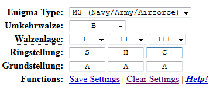
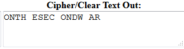

------------------------------------
[Nazistas] - Cripto 40 Pontos
------------------------------------

> Treinamento básico para o proximo nivel!
  Senha: FIKFNDCLCXNYBK
  TYPE: M3 (Navy/Army/Airforce)
  MODEL ---B---
  Ringstellung: SHC

  Formato: SHC{}

Chegou a parte que adoro,Cripto,então basicamente essa codificação foi usada pela marinha alemã
durante a segunda guerra mundial,Voce tem que decifrar mensagens alemãs!
Entrando no site - http://enigma.louisedade.co.uk/enigma.html
Colocando as informaçoes fornecidas
  TYPE: M3 (Navy/Army/Airforce)
  MODEL ---B---
  Ringstellung: SHC

Selecione "Block of text" Coloque a senha que será descriptada para texto e click em Decipher Text
  Senha: FIKFNDCLCXNYBK

Vai retornar ONTH ESEC ONDW AR
arrumando vai ficar THESECONDWAR que a tradução fica A segunda guerra (mas isso não intereça)
Agora é só colocar SHC{THESECONDWAR}
Ai está a flag ;)

Heaven -- BigBangTeam
