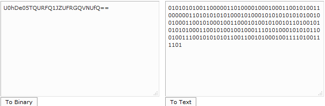
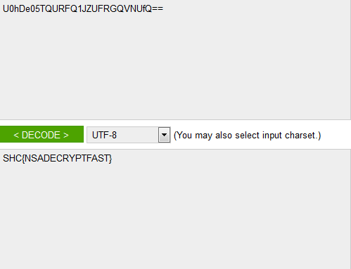

------------------------------------
[Restrict acess] - CUSTOM 20 Pontos
------------------------------------

> Nada de novo! apenas o que você já sabe! isso vai te lembrar do que somos capaz!

> http://ctf.sucurihc.org/flag/eua/custom20/custom20.txt

###Conhecendo o arquivo

Abrindo o arquivo logo de cara era um binário!
Acessando um decode online 
``` http://www.roubaixinteractive.com/PlayGround/Binary_Conversion/Binary_To_Text.asp ```

###Decodificando o binário
Colocando o binario e decodificando para texto ele voltava um base64!

	

Base 64 - ``` U0hDe05TQURFQ1JZUFRGQVNUfQ== ```

###Decodificando o Base64

Acessando outro decode online agora de base 64

``` https://www.base64decode.org ```

Decodificando ele retornaria a flag!

###Flag



``` SHC{NSADECRYPTFAST} ```

##Heaven -- BigBangTeam
